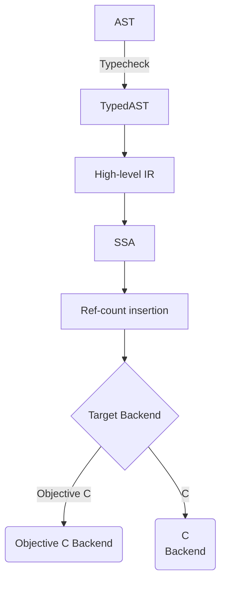

## A few notes

### Functional Core, Imperative Shell

Functional core, imperative shell. A majority of the code-base *should* be purely functional and Lilac
employs the existence of concepts from category theory (and Haskell) such as functors, applicatives, monads - minus monad transformers: they stack *naturally* via `protocol`s.

```
struct Ctx
  config: Config
  db: DBConnection
end

implement Reader Ctx on Ctx
  message ask (self: Ctx) = self.ctx
end

implement State DBConnection on Ctx
  message put (self: Ctx, new-state: DBConnection) = self with { db: new-state }
  ...
end

def main () -> IO () = do
  let ctx  = Ctx { config: .., db: [DBConnection open-connection-on:4444] } in
  let cfg  = [ctx ask].config in
  let db   = [ctx ask].db in
  let ctx' = [ctx put new-state:[db insert-row-named:"foo" value:"bar"]] in
  [ctx' return]
end
```

<details>
<summary>Intermediate passes used in Lilac's compiler</summary>

### Passes



</details>


### Message Selectors

#### Message/selector call syntax:
```objc
[String by-appending-string: "Hello world"]   -- static message on type
[prime-numbers filtered-by: |n| [n is-even]]  -- single argument
[contents write-to-file-named: "file.txt" encoding: utf-8] -- multi-argument
```

#### Lilac's equivalent to NSObject:
```
protocol Object'
  message superclass (self: impl Object') -> impl Class'
  message is-equal (self: impl Object') -> bool
  message hash (self: impl Object') -> i64
end
```

Data lives in one of two places: on the stack or on the heap. 

Lilac provides both raw (`*T`) and ARC pointers (`@T`) for data stored on the heap.

ARC is entirely opt-in and the backend emits `lilac_retain` and `lilac_release` to
automatically manage memory behind the scenes.

#### Message Dispatch

Message dispatch is routed using Lilacs equivalent to `objc_msgSend` - `lilac_msgsend`

`lilac_msgsend` is an extremely fast trampoline written in pure Assembly which jumps to a selector
without the overhead of a C function call (and its prologue and epologue), deferring only to a slower
C based implementation if the cache hit fails. 

```c
// 1. Interned Selector String Literals
static const char __sel_str_write_to_file_named_encoding[] __attribute__((section(".rodata.lilac_strs"))) = "write-to-file-named:encoding:";

// 2. Global Weak Handles (Coalesced into 1 unique memory address at link time)
__attribute__((weak, section(".data.rel.ro.lilac_sels")))
const void *sel_write_to_file_named_encoding_ = (const void *)__sel_str_write_to_file_named_encoding;

// 3. Message dispatch using lilac_msgsend on the selector
lilac_msgsend(contents, SEL(write_to_file_named_encoding), "file.txt", "utf-8");

```

It is an experimental cross-platform implementation of `objc_msgSend`, that works entirely freestanding.

For reference, this is Apple's implementation of `objc_msgSend`:
https://developer.apple.com/documentation/objectivec/objc_msgsend